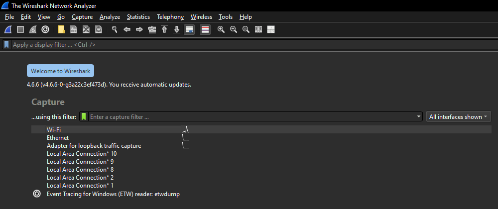
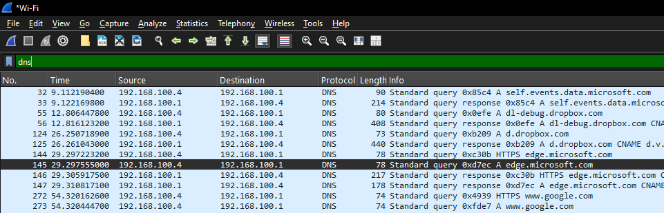
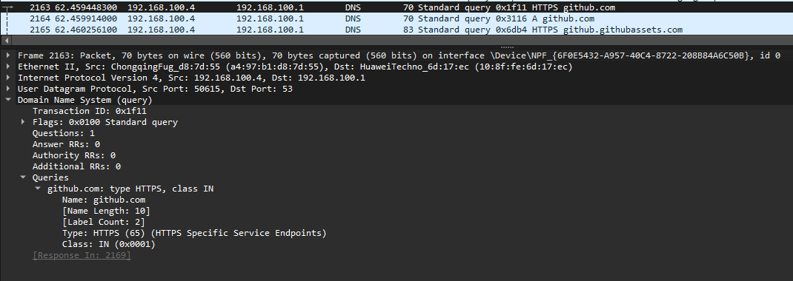
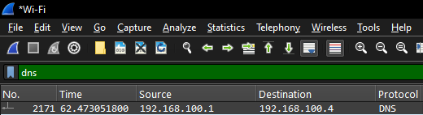

# DNS Traffic Investigation with Wireshark

## Introduction

This project demonstrates the investigation of DNS traffic using Wireshark.

The objective of the lab was to capture DNS communications, analyze DNS queries and responses, identify domain resolution activity, and understand how DNS traffic can be monitored from a defensive cybersecurity perspective.

DNS is one of the most important protocols analyzed by SOC analysts because it provides visibility into domains accessed by systems and can help identify suspicious or malicious network activity.

## Lab Environment

* Windows 10
* Wireshark
* Web Browser
* Local Network Environment

## Investigation Objectives

* Capture DNS traffic
* Analyze DNS queries and responses
* Identify domain resolution activity
* Review source and destination communication

## 1. Wireshark Setup

The investigation began by launching Wireshark and selecting the active network interface used for Internet connectivity.

Wireshark is a widely used packet analysis tool that provides visibility into network communications and allows analysts to inspect protocols, monitor traffic, and investigate network activity in real time.

Selecting the correct interface is an important first step because it ensures that relevant traffic is captured during the investigation.



---

## 2. DNS Traffic Capture Configuration

After selecting the network interface, packet capture was initiated and a DNS display filter was applied.

Filter used:

```text
dns
```

Applying protocol filters helps analysts focus on specific types of traffic and reduces the amount of unrelated network activity displayed during an investigation.

This approach is commonly used in SOC environments when analyzing DNS communications, HTTP traffic, authentication protocols, and other network activity.


---

## 3. DNS Traffic Generation

To generate DNS activity, several websites were accessed through a web browser while Wireshark was actively capturing packets.

Example domains visited included:

* github.com
* google.com
* microsoft.com
* wikipedia.org

As the browser attempted to access these domains, DNS queries and responses were generated and captured by Wireshark.

The resulting packet capture provided the evidence required for further analysis of domain resolution activity.



## 4. DNS Query Analysis

A DNS query generated while accessing GitHub was selected for detailed analysis.

The captured packet recorded a DNS request for the domain github.com.

### Query Information

**Query Name**

```text
github.com
```

**Record Type**

```text
HTTPS
```

### Analysis

The DNS query requested information associated with the github.com domain.

DNS queries allow systems to locate remote services by translating human-readable domain names into information that can be used to establish network communications.

Monitoring DNS queries provides valuable visibility into the domains accessed by systems and is commonly used during threat hunting, network monitoring, and incident response investigations.



## 5. DNS Response Analysis

The corresponding DNS response was reviewed to identify the information returned by the DNS server.

The response successfully resolved the github.com domain and provided the IPv4 address associated with the service.

### Response Information

**Domain**

```text id="0xq9rj"
github.com
```

**Record Type**

```text id="5q6f4q"
A (Host Address)
```

**Resolved IP Address**

```text id="5d8hzc"
140.82.113.3
```

### Analysis

The DNS server successfully resolved github.com and returned the IPv4 address 140.82.113.3.

DNS responses provide the information required for a client device to establish communication with remote services. By reviewing DNS responses, analysts can identify the infrastructure associated with a domain and better understand network communication patterns.

This type of analysis is commonly performed during network investigations, threat hunting activities, and incident response operations.


## 6. Source and Destination Analysis

The DNS communication was further analyzed by reviewing the source and destination addresses recorded within the packet capture.

### Network Information

**Source**

```text id="jwhv6j"
192.168.100.1
```

**Destination**

```text id="2l36tz"
192.168.100.4
```

### Analysis

The captured packet represented a DNS response transmitted from the local DNS service to the client device.

The source address 192.168.100.1 corresponds to the local network gateway or DNS server, while the destination address 192.168.100.4 corresponds to the client system that initiated the DNS request.

Analyzing source and destination information allows security analysts to understand communication flows, identify where requests originate, and determine how responses are delivered across a network.

This information is commonly used during network monitoring, incident response, and traffic analysis investigations.



## Key Findings

During the investigation, several important findings were identified:

* DNS traffic was successfully captured using Wireshark.
* DNS queries and responses were identified and analyzed.
* A DNS query for github.com was observed.
* The DNS server successfully resolved github.com.
* The returned IPv4 address was 140.82.113.3.
* Communication between the DNS service and the client system was successfully identified.
* Source and destination addresses were analyzed.
* DNS activity was consistent with normal web browsing behavior.

---

## Skills Demonstrated

This project provided hands-on experience with:

* Wireshark Packet Analysis
* DNS Traffic Monitoring
* DNS Query Investigation
* DNS Response Analysis
* Network Traffic Analysis
* Packet Inspection
* Source and Destination Analysis
* Network Monitoring
* Threat Hunting Fundamentals
* Evidence Collection and Documentation
* SOC Investigation Methodology

---

## Lessons Learned

Throughout this project, I gained practical experience in:

* Capturing DNS traffic using Wireshark.
* Understanding how DNS queries and responses operate within a network.
* Identifying domain resolution activity.
* Analyzing source and destination communication paths.
* Interpreting packet-level network data.
* Investigating network traffic from a defensive cybersecurity perspective.
* Applying traffic analysis techniques commonly used in SOC environments.
* Collecting and documenting evidence in a structured investigation.

This exercise strengthened my understanding of DNS communications, packet analysis, and network monitoring techniques used by security analysts during investigations.

---

## SOC Analyst Assessment

The investigation demonstrated how DNS traffic can provide valuable visibility into network activity and domain resolution behavior.

The analysis identified a DNS query for github.com and confirmed that the DNS server successfully returned the IPv4 address 140.82.113.3. The communication flow between the DNS service and the client system was successfully reconstructed using packet capture data.

No suspicious domains, abnormal communication patterns, or indicators of malicious activity were identified during the investigation. The observed activity was consistent with legitimate web browsing behavior.

This methodology can be applied in real-world SOC environments to identify suspicious domains, investigate potential command-and-control communications, and monitor network activity during security investigations.

---

## Conclusion

This project demonstrated the investigation of DNS traffic using Wireshark.

By capturing and analyzing DNS communications, it was possible to identify domain resolution activity, review DNS queries and responses, and understand how systems locate remote services across a network.

The investigation provided practical experience in packet analysis, DNS monitoring, network traffic investigation, and evidence collection techniques commonly used by SOC analysts and cybersecurity professionals.

This project highlights the importance of DNS analysis as a fundamental component of network security monitoring and incident response operations.


* Understand DNS monitoring techniques
* Develop network traffic analysis skills
